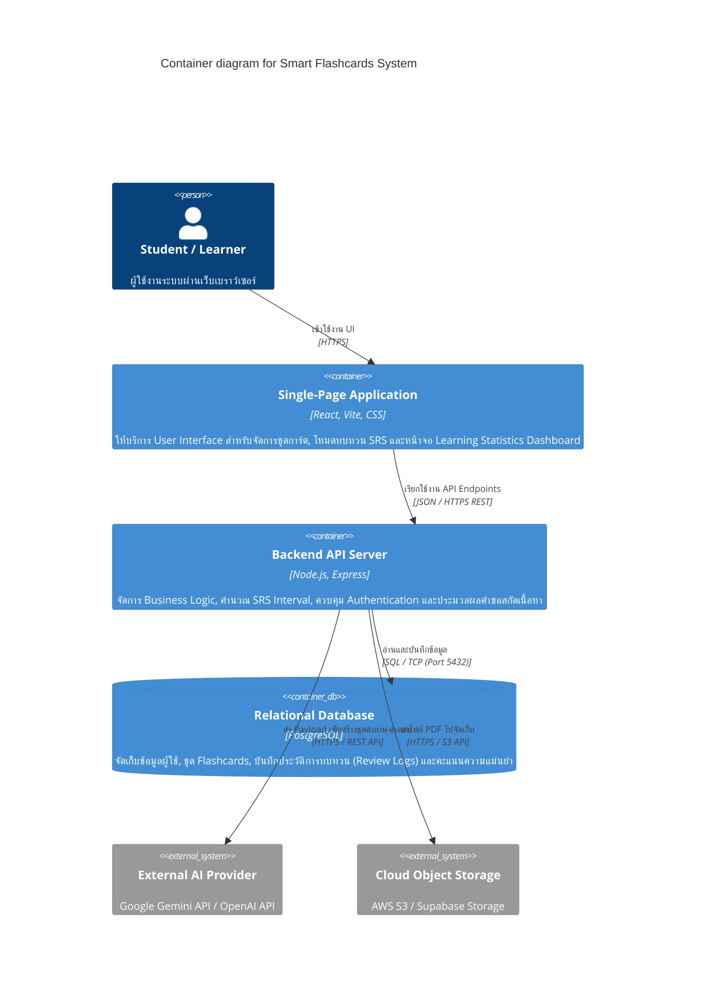

# C4 Model — Level 2: Container Diagram

ไดอะแกรมแสดงสถาปัตยกรรมภายในของ Smart Flashcards System ซึ่งประกอบด้วย Web Application, API Server, Database และการเชื่อมต่อ External Services

```mermaid
C4Container
    title Container diagram for Smart Flashcards System

    Person(user, "Student / Learner", "ผู้ใช้งานระบบผ่านเว็บเบราว์เซอร์")

    Container(web_app, "Single-Page Application", "React, Vite, CSS", "ให้บริการ User Interface สำหรับจัดการชุดการ์ด, โหมดทบทวน SRS และหน้าจอ Learning Statistics Dashboard")
    Container(api_server, "Backend API Server", "Node.js, Express", "จัดการ Business Logic, คำนวณ SRS Interval, ควบคุม Authentication และประมวลผลคำขอสกัดเนื้อหา")
    ContainerDb(database, "Relational Database", "PostgreSQL", "จัดเก็บข้อมูลผู้ใช้, ชุด Flashcards, บันทึกประวัติการทบทวน (Review Logs) และคะแนนความแม่นยำ")

    System_Ext(ai_api, "External AI Provider", "Google Gemini API / OpenAI API")
    System_Ext(s3_storage, "Cloud Object Storage", "AWS S3 / Supabase Storage")

    Rel(user, web_app, "เข้าใช้งาน UI", "HTTPS")
    Rel(web_app, api_server, "เรียกใช้งาน API Endpoints", "JSON / HTTPS REST")
    Rel(api_server, database, "อ่านและบันทึกข้อมูล", "SQL / TCP (Port 5432)")
    Rel(api_server, ai_api, "ส่ง Payload เพื่อสร้างชุดคำถาม-คำตอบ", "HTTPS / REST API")
    Rel(api_server, s3_storage, "ส่งไฟล์ PDF ไปจัดเก็บ", "HTTPS / S3 API")

```
