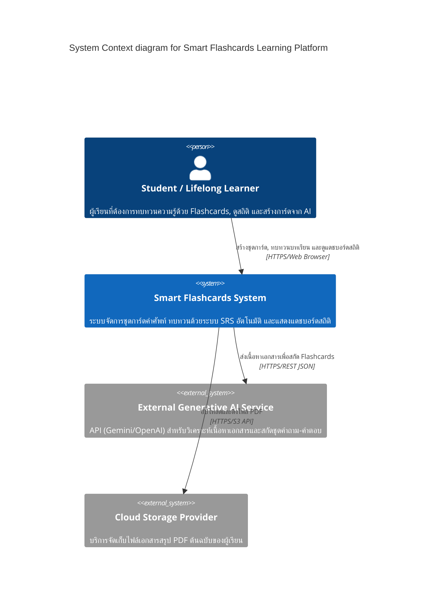

# C4 Model — Level 1: System Context Diagram

ไดอะแกรมแสดงภาพรวมบริบทของระบบ Smart Flashcards ผู้ใช้งาน และระบบภายนอกที่เกี่ยวข้อง

```mermaid
C4Context
    title System Context diagram for Smart Flashcards Learning Platform

    Person(student, "Student / Lifelong Learner", "ผู้เรียนที่ต้องการทบทวนความรู้ด้วย Flashcards, ดูสถิติ และสร้างการ์ดจาก AI")

    System(flashcard_sys, "Smart Flashcards System", "ระบบจัดการชุดการ์ดคำศัพท์ ทบทวนด้วยระบบ SRS อัตโนมัติ และแสดงแดชบอร์ดสถิติ")

    System_Ext(ai_service, "External Generative AI Service", "API (Gemini/OpenAI) สำหรับวิเคราะห์เนื้อหาเอกสารและสกัดชุดคำถาม-คำตอบ")
    System_Ext(cloud_storage, "Cloud Storage Provider", "บริการจัดเก็บไฟล์เอกสารสรุป PDF ต้นฉบับของผู้เรียน")

    Rel(student, flashcard_sys, "สร้างชุดการ์ด, ทบทวนบทเรียน และดูแดชบอร์ดสถิติ", "HTTPS/Web Browser")
    Rel(flashcard_sys, ai_service, "ส่งเนื้อหาเอกสารเพื่อสกัด Flashcards", "HTTPS/REST JSON")
    Rel(flashcard_sys, cloud_storage, "อัปโหลดและดึงไฟล์ PDF", "HTTPS/S3 API")


```
